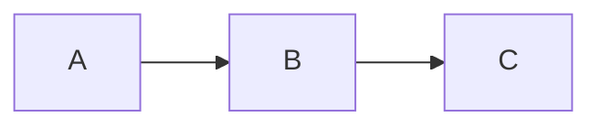
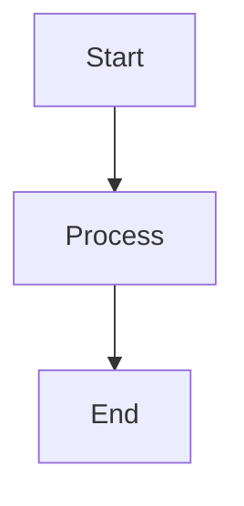

# API Reference

## Components

### MarkdownFlow

Main component for rendering markdown with typewriter effects.

```typescript
interface MarkdownFlowProps {
  initialContentList?: ContentItem[];
  customRenderBar?: CustomRenderBarProps;
  onSend?: (content: OnSendContentParams) => void;
  typingSpeed?: number;
  enableTypewriter?: boolean;
  onBlockComplete?: (blockIndex: number) => void;
}

type ContentItem = {
  content: string;
  isFinished?: boolean;
  defaultInputText?: string;
  defaultButtonText?: string;
  readonly?: boolean;
  customRenderBar?: CustomRenderBarProps;
};

type OnSendContentParams = {
  buttonText?: string;
  variableName?: string;
  inputText?: string;
};
```

**Props:**

- `initialContentList` - Array of content blocks to render
- `typingSpeed` - Typing animation speed (default: 30ms/char)
- `enableTypewriter` - Enable typewriter effect (default: false)
- `onSend` - Callback for user interactions
- `onBlockComplete` - Called when a block finishes typing
- `customRenderBar` - Custom component for additional UI

**Example:**

```tsx
<MarkdownFlow
  initialContentList={[
    {
      content: "# Welcome\n\nChoose: ?[%{{choice}} A | B | C]",
      isFinished: false,
    },
  ]}
  typingSpeed={50}
  onSend={(params) => {
    if (params.variableName === "choice") {
      console.log("Selected:", params.buttonText);
    }
  }}
/>
```

### ScrollableMarkdownFlow

Enhanced version with auto-scrolling and scroll management.

```typescript
interface ScrollableMarkdownFlowProps extends MarkdownFlowProps {
  height?: string | number;
  className?: string;
}
```

**Additional Props:**

- `height` - Container height (default: "100%")
- `className` - Additional CSS classes

**Features:**

- Auto-scrolls to bottom on new content
- Shows scroll-to-bottom button when needed
- Smooth scrolling behavior

**Example:**

```tsx
<ScrollableMarkdownFlow
  height="400px"
  initialContentList={messages}
  onSend={handleUserMessage}
  className="chat-container"
/>
```

### ContentRender

Core component for rendering individual markdown blocks.

```typescript
interface ContentRenderProps {
  content: string;
  customRenderBar?: CustomRenderBarProps;
  onSend?: (content: OnSendContentParams) => void;
  typingSpeed?: number;
  enableTypewriter?: boolean;
  defaultButtonText?: string;
  defaultInputText?: string;
  readonly?: boolean;
  onTypeFinished?: () => void;
}
```

**Props:**

- `content` - Markdown content to render
- `typingSpeed` - Animation speed (default: 30)
- `enableTypewriter` - Enable animation (default: false)
- `readonly` - Make interactive elements read-only
- `onTypeFinished` - Called when typing completes

**Supported Markdown:**

- Standard markdown (headers, lists, links, etc.)
- GitHub Flavored Markdown (tables, task lists)
- Math expressions with KaTeX: `$E = mc^2$`
- Mermaid diagrams
- Code syntax highlighting
- Custom interactive syntax

**Custom Syntax:**

````markdown
# Buttons

?[Click me]

# Variable inputs

?[%{{userName}} Enter name...]

# Multiple choice

?[%{{color}} Red | Blue | Green]

# Mermaid diagrams


````

## Hooks

### useTypewriter

Manages typewriter animation effects.

```typescript
function useTypewriter(
  content: string,
  speed?: number,
  disabled?: boolean
): {
  displayText: string;
  isComplete: boolean;
  start: () => void;
  pause: () => void;
  reset: () => void;
};
```

**Example:**

```tsx
const { displayText, isComplete, start, pause } = useTypewriter(
  "Hello, World!",
  50,
  false
);

return (
  <div>
    <p>{displayText}</p>
    {!isComplete && <button onClick={pause}>Pause</button>}
  </div>
);
```

### useScrollToBottom

Auto-scroll management for containers.

```typescript
function useScrollToBottom(
  containerRef: RefObject<HTMLElement>,
  dependencies: any[],
  options?: {
    behavior?: "smooth" | "auto";
    autoScrollOnInit?: boolean;
    scrollDelay?: number;
  }
): {
  showScrollToBottom: boolean;
  handleUserScrollToBottom: () => void;
};
```

**Example:**

```tsx
const containerRef = useRef(null);
const { showScrollToBottom, handleUserScrollToBottom } = useScrollToBottom(
  containerRef,
  [messages.length],
  { behavior: "smooth" }
);

return (
  <div ref={containerRef}>
    {messages.map((msg) => (
      <div key={msg.id}>{msg.text}</div>
    ))}
    {showScrollToBottom && (
      <button onClick={handleUserScrollToBottom}>↓</button>
    )}
  </div>
);
```

## Types

```typescript
// Content item in flow
type ContentItem = {
  content: string;
  isFinished?: boolean;
  defaultInputText?: string;
  defaultButtonText?: string;
  readonly?: boolean;
  customRenderBar?: CustomRenderBarProps;
};

// User interaction parameters
type OnSendContentParams = {
  buttonText?: string;
  variableName?: string;
  inputText?: string;
};

// Custom render bar component
type CustomRenderBarProps = React.ComponentType<{
  content?: string;
  onSend?: (content: OnSendContentParams) => void;
  displayContent: string;
}>;

// All component props are exported
import type {
  MarkdownFlowProps,
  ScrollableMarkdownFlowProps,
  ContentRenderProps,
} from "markdown-flow-ui";
```

## Plugins

### Built-in Plugins

**Custom Variable Plugin:**

Handles interactive buttons and inputs.

```markdown
?[Button Text] # Simple button
?[%{{variable}} Placeholder...] # Input field
?[%{{choice}} A | B | C] # Multiple choice
```

**Mermaid Plugin:**

Renders diagrams using Mermaid with built-in error handling and syntax validation.

````markdown

````

**Features:**

- Pre-validation of Mermaid syntax before rendering
- Friendly error messages with helpful hints
- Safe rendering with security checks
- Support for all Mermaid diagram types (flowchart, sequence, pie, gantt, etc.)
- Elegant error display with source code preview

### Creating Custom Plugins

```typescript
// Define plugin component
const CustomPlugin: React.FC<{ value: string; type?: string }> = ({
  value,
  type = 'default'
}) => {
  return (
    <div className="custom-plugin">
      <span>{type}: {value}</span>
    </div>
  );
};

// Register with ContentRender
const components = {
  'custom-element': CustomPlugin,
};
```

## Styling

The library uses Tailwind CSS and provides customization through:

**CSS Classes:**

```css
.markdown-flow {
}
.content-render {
}
.content-render-table {
}
.content-render-ol {
}
.content-render-ul {
}
.scrollable-markdown-container {
}
.scroll-to-bottom-btn {
}
```

**CSS Variables:**

```css
:root {
  --markdown-flow-primary: #2563eb;
  --markdown-flow-background: #ffffff;
  --markdown-flow-text: #1f2937;
  --markdown-flow-border: #d1d5db;
  --markdown-flow-code-bg: #f3f4f6;
}
```
